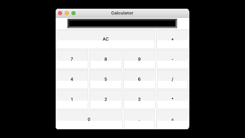

# Calculator

This is a very simple calculator.

The calcualtor will slove your simple Alegrba questions from addition to division.

This was created and designed by using the 'Tkinter' module. The code can be download and ran, no editing needed.

An example of the running is code is below:

